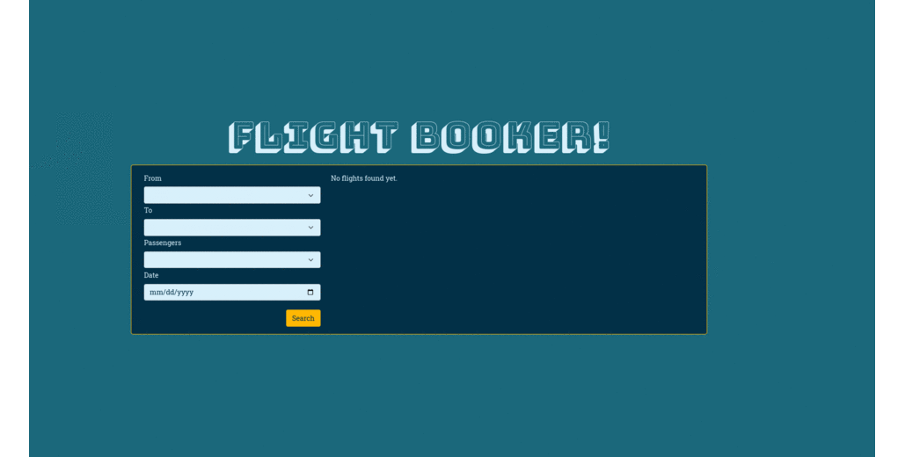

# README - Flights Booking MINI APP

## Introduction

This is a flight booking application. It is a simple application that allows users to book flights. The application is written in Ruby and uses the Ruby on Rails framework.

## Overview

This is an application to create reservations for flights.

The home page is a flight search engine that allows you to move towards creating a reservation.

The reservation is a complex form that allows you to find or create passengers (with mail)

After the reservation creation is complete, you see the newly created reservations.

### Technical Details
- Language: Ruby 3.1.2
- Framework: Rails 7.0.1
- DB: Postgresql
- Styles: Bootstrap

### Gems used:
- FactoryBot
- Faker
- Bootstrap

### Tests
- 25 tests were carried out to test the models and controllers

## Data model
  * Airport:
    - name: string
    - city: string
    - country: string
    - code: string
  * Flight:
    - number: string
    - departure_date: datetime
    - arrival_date: datetime
    - departure_airport: Airport
    - arrival_airport: Airport
    - price: float
    - available_seats: integer
    - status: string
  * Reservation:
    - id: integer
    - user_id: integer
    - flight_id: integer
    - created_at: datetime
    - updated_at: datetime
  * User:
    - id: integer
    - name: string
    - email: string
    - password_digest: string
    - created_at: datetime
    - updated_at: datetime
  * Passenger:
    - id: integer
    - user_id: integer
    - reservation_id: integer
    - name: string
    - email: string
    - created_at: datetime
    - updated_at: datetime
  * Admin:
    - id: integer
    - name: string
    - email: string
    - password_digest: string
    - created_at: datetime
    - updated_at: datetime